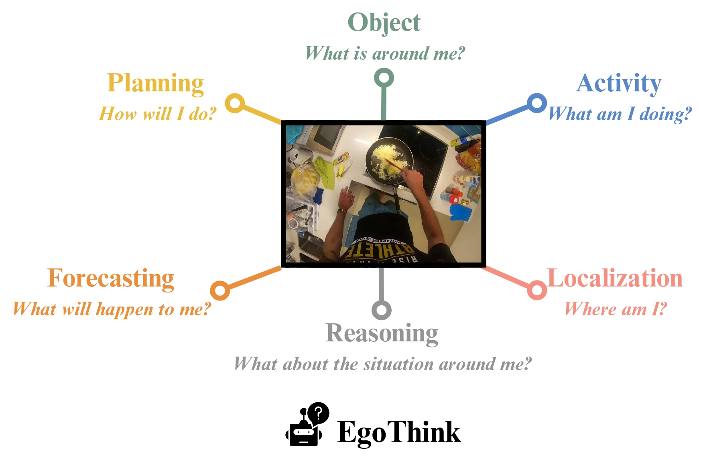
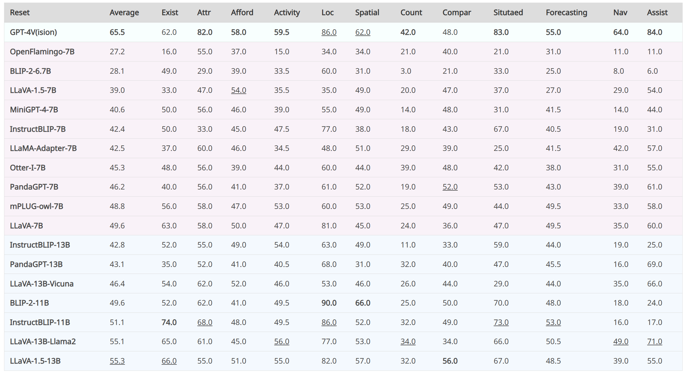

<div align="center">

<h2>EgoThink: Evaluating First-Person Perspective Thinking Capability of Vision-Language Models</h2>

[**🌐 Homepage**](https://adacheng.github.io/EgoThink/) | [**🤗 Dataset**](https://huggingface.co/datasets/EgoThink/EgoThink) | [**🤗 Paper**](https://huggingface.co/papers/2311.15596) | [**📖 arXiv**](https://arxiv.org/abs/2311.15596) | [**🏆 Leaderboard**](https://adacheng.github.io/EgoThink/#leaderboard)

<p align="center">
  
</p>

<b><i>Figure 1:</i></b> The main categories of EgoThink to comprehensively assess the capability of thinking from a first-person perspective.
</div>


## 🔔 News
<i>
[2024-10]: Our related paper <a href="https://arxiv.org/abs/2410.11623">VidEgoThink: Assessing Egocentric Video Understanding Capabilities for Embodied AI</a> has been released.<br>
[2024-09]: EgoThink is invited to be presented in <a href="https://zhidx.com/p/441426.html">ZhiDX</a>.<br>
[2024-04]: EgoThink is invited to be presented in ByteDance.<br>
[2024-04]: EgoThink will be presented as a Poster (<b>Highlight</b>👀) in CVPR 2024.<br>
[2024-03]: EgoThink is presented in <a href="https://www.bilibili.com/video/BV13D42157gP/?spm_id_from=333.1387.search.video_card.click">AITIME</a>.<br>
[2024-02]: EgoThink has been accepted by <b>CVPR 2024</b>.<br>
[2023-11]: Our paper <a href="https://arxiv.org/abs/2311.15596">Can Vision-Language Models Think from a First-Person Perspective?</a> has been released.<br>
</i>

## 💾 Dataset

### Overview

<div align="center">
  

  <b><i>Figure 2:</i></b> Categories with fine-grained dimensions and their corresponding examples of EgoThink benchmark.
</div>

### Download (Choose One of Two)

1. Clone our [GitHub Repo](https://github.com/AdaCheng/EgoThink/tree/main/EgoThink).
```sh
git clone https://github.com/AdaCheng/EgoThink.git
cd EgoThink
```

2. Download in our [Hugging Face Repo](https://huggingface.co/datasets/EgoThink/EgoThink). 

## 🔧 Dependencies

## 📊 Evaluation

### Add new model

> 🫰 <b>Thank you very much if you would like to contribute the code of the new model you have deployed!</b>

1. create `test_{new_model}.py` in `/models`.
2. Add the new model in `get_model()` in `/models/__init__.py`.
```sh
# BLIP2-7B
 if model_name == 'blip2-7b':
        from .test_blip2 import TestBlip2
        return TestBlip2(name='blip2_opt', model_type='pretrain_opt6.7b', config_path='/models/blip_configs/blip2_pretrain_opt6.7b.yaml', device=device)
```

### Inference
```sh
# dataset: Activity, Object/existence, etc., currently does not support direct calls from hugging face
# MODEL: models defined in the models file
# DEVICE: GPU id, 0/1/2..., currently only single card can run
python eval.py \
    --model_name $MODEL \
    --annotation_path /${dataset}/annotations.json \
    --answer_path /answer/${dataset} \
    --batch_size 1 \
    --device $DEVICE
```

### Evaluation
```sh
# dataset: Activity, Object/existence, etc.
# EVA_MODELS: a list of models to be evaluated (separated by spaces), for example "llava-13b-llama2 llava-1.5-13b llava-1.5-7b"
# $EVA_JUDGE_MODEL: gpt-4 (default), gpt-3.5-turbo, claude-2, etc.

export OPENAI_API_KEY= 
export ANTHROPIC_API_KEY=
export OPENAI_API_BASE=

python  gen_judgment.py \
    --data-folder data_egothink \
    --bench-name $dataset \
    --mode single \
    --model-list $EVA_MODELS \
    --judge-model $EVA_JUDGE_MODEL 
    --parallel 4
    --judge-file judge_prompts.jsonl
```

### Show Results

```sh
# EVA_MODELS: a list of models to be evaluated (separated by spaces), for example "llava-13b-llama2 llava-1.5-13b llava-1.5-7b"
# $EVA_JUDGE_MODEL: gpt-4 (default), gpt-3.5-turbo, claude-2, etc.
python show_result.py \
    --input-file {data_folder}/{bench-name}/model_judgment/{judge-model}_single.jsonl \
    --judge-model $EVA_JUDGE_MODEL \
    --model-list  $EVA_MODELS \
    --mode single
```

## 🏆 Leaderboard

### Update
> 👋 <b>Feel free to contribute to the performance of your model by adding it to our "RESULTS SECTION" (from line 398) in <a href="https://github.com/AdaCheng/EgoThink/blob/main/index.html">index.html</a>; we will review and merge it accordingly.</b>

```html
<tr style="background-color: #f8fffe;">
    <td style="text-align: left;"><b>GPT-4V(ision)</b></td>
    <td><b>65.5</b></td>
    <td>62.0</td>
    <td><b>82.0</b></td>
    <td><b>58.0</b></td>
    <td><b>59.5</b></td>
    <td style="text-decoration: underline;">86.0</td>
    <td style="text-decoration: underline;">62.0</td>
    <td><b>42.0</b></td>
    <td>48.0</td>
    <td><b>83.0</b></td>
    <td><b>55.0</b></td>
    <td><b>64.0</b></td>
    <td><b>84.0</b></td>
</tr> 
```

### Overview

<div align="center">
  

  <b><i>Table 1:</i></b> Combined single-answer grading scores on zero-shot setups for various dimensions. The <b>bold</b> indicates the best performance while the <u>underline</u> indicates the second-best performance. Exist, Attr, Afford, Loc, Spatial, Count, Compar, Situated, Nav and Assist represent existence, attribute, affordance, location, spatial relationship, counting, comparison, situated reasoning, navigation, and assistance.
</div>


## Contact
- Sijie Cheng: csj23@mails.tsinghua.edu.cn

## Citation

```bibtex
@InProceedings{Cheng_2024_CVPR,
    author    = {Cheng, Sijie and Guo, Zhicheng and Wu, Jingwen and Fang, Kechen and Li, Peng and Liu, Huaping and Liu, Yang},
    title     = {EgoThink: Evaluating First-Person Perspective Thinking Capability of Vision-Language Models},
    booktitle = {Proceedings of the IEEE/CVF Conference on Computer Vision and Pattern Recognition (CVPR)},
    month     = {June},
    year      = {2024},
    pages     = {14291-14302}
}
```

## Acknowledge
Thanks to Xiaolong Wang, Yangyang Yu, Zixin Sun, and Zhaoyang Li for their contributions to data collection and construction.
We appreciate Zeyuan Yang, Szymon Tworkowski, Guan Wang, and Zonghan Yang for their support of API resources; Xinghang Li for his valuable discussion; Siyu Wang for her code base on the annotation system.

Furthermore, we appreciate the developers behind the following projects for their significant contributions to our research: [Ego4D](https://github.com/facebookresearch/Ego4d), [Multi-Modality-Arena](https://github.com/OpenGVLab/Multi-Modality-Arena/tree/main/tiny_lvlm_evaluation), [FastChat](https://github.com/lm-sys/FastChat).
